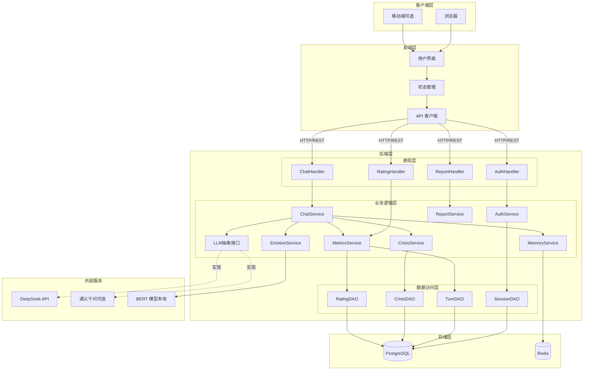
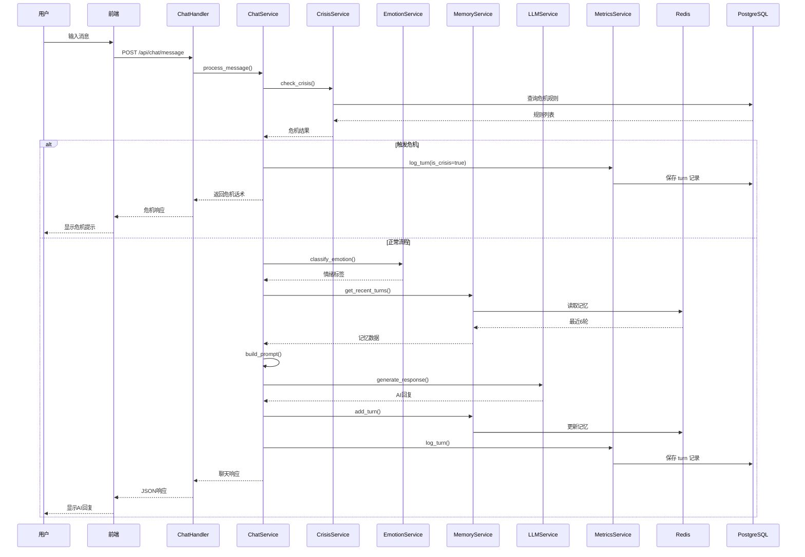

# 系统架构文档

## 整体架构概览

情绪对话系统采用**前后端分离**的全栈架构，后端遵循**分层设计原则**，通过**依赖注入**实现组件解耦，支持灵活扩展和替换。

### 团队组织

项目团队共5人，分工如下：

- **模型团队**（2人）：负责BERT情绪识别模型的训练、优化、部署，以及LLM接口集成和提示词工程
- **后端团队**（2人）：负责FastAPI服务开发、数据库设计、Redis缓存管理、API接口实现和系统架构设计
- **前端团队**（1人）：负责React应用开发、UI/UX设计、状态管理和与后端API的集成




---

## 后端架构详解

### 后端目录结构

```
app/
├── __init__.py
├── main.py                        # FastAPI 应用入口
├── database.py                    # 数据库连接与会话管理
├── dependencies.py                # 依赖注入工厂函数
├── handlers/                      # Handler 层（路由）
│   ├── auth_handler.py
│   ├── chat_handler.py
│   ├── rating_handler.py
│   └── report_handler.py
├── services/                      # Service 层（业务逻辑）
│   ├── auth_service.py
│   ├── chat_service.py
│   ├── emotion_service.py
│   ├── memory_service.py
│   ├── crisis_service.py
│   ├── metrics_service.py
│   ├── report_service.py
│   ├── mock_llm_service.py
│   ├── deepseek_llm_service.py
│   ├── prompt_builder.py
│   └── response_parser.py
├── dao/                           # DAO 层（数据访问）
│   ├── session_dao.py
│   ├── turn_dao.py
│   ├── crisis_dao.py
│   └── rating_dao.py
├── models/                        # SQLAlchemy ORM 模型
│   └── models.py
├── schemas/                       # Pydantic 请求/响应模型
│   ├── auth.py
│   ├── chat.py
│   ├── rating.py
│   └── report.py
└── utils/                         # 工具函数
    └── logging.py
```

### 分层设计（Handler-Service-DAO）

#### 1. Handler 层（表现层 / 路由层）

**职责**:

- 接收 HTTP 请求，进行参数验证
- 调用 Service 层完成业务逻辑
- 返回 HTTP 响应
- 统一异常处理
- API 文档生成（FastAPI 自动）

**设计原则**:

- 薄层设计：不包含业务逻辑
- 依赖注入：通过 `Depends()` 注入 Service
- 类型安全：使用 Pydantic 模型验证

**示例**:

```python
# app/handlers/chat_handler.py
from fastapi import APIRouter, Depends, HTTPException
from app.schemas.chat import ChatRequest, ChatResponse
from app.services.chat_service import ChatService
from app.dependencies import get_chat_service

router = APIRouter(prefix="/api/chat", tags=["chat"])

@router.post("/message", response_model=ChatResponse)
async def send_message(
    request: ChatRequest,
    chat_service: ChatService = Depends(get_chat_service)
) -> ChatResponse:
    """发送聊天消息"""
    try:
        return await chat_service.process_message(
            request.session_id,
            request.user_message,
            request.token
        )
    except ValueError as e:
        raise HTTPException(status_code=400, detail=str(e))
    except PermissionError as e:
        raise HTTPException(status_code=401, detail=str(e))
```

#### 2. Service 层（业务逻辑层）

**职责**:

- 业务流程编排
- 业务规则实现
- 事务管理
- 调用多个 DAO 协同完成任务
- 调用外部服务（AI 模型、缓存）
- 异常处理和降级策略

**设计原则**:

- 单一职责：每个 Service 专注一个业务域
- 依赖注入：通过构造函数注入 DAO 和其他 Service
- 面向接口编程：依赖抽象而非具体实现
- 异步优先：所有 I/O 操作使用 async/await

**核心服务**:

**ChatService（聊天服务）**:

- 编排核心聊天流程
- 协调危机检测、情绪识别、记忆管理、LLM 调用
- 处理超时和降级

**EmotionService（情绪识别服务）**:

- 加载和管理 BERT 模型
- 执行情绪分类推理
- 缓存模型结果

**MemoryService（记忆管理服务）**:

- 管理 Redis 中的短期记忆
- 添加/获取最近 N 轮对话
- 处理记忆截断和过期

**CrisisService（危机干预服务）**:

- 匹配危机关键词
- 返回固定干预话术
- 记录危机事件

**LLMService（LLM 服务抽象）**:

- 定义 LLM 调用的统一接口
- 支持多种 LLM 实现（DeepSeek、通义千问等）
- 超时控制和错误处理

**MetricsService（指标采集服务）**:

- 记录每轮对话的指标（调用 `TurnDAO.create_turn()`）
- 统计性能数据（BERT 延迟、LLM 延迟）

**ReportService（报告服务）**:

- 编排周报聚合逻辑，组装 `GET /api/reports/weekly` 的完整响应
- 实现流程：
  1. 根据 `session_id` 和时间范围，调用 `TurnDAO` 查询对话数据
  2. 调用 `TurnDAO.get_emotion_distribution()` 获取情绪分布统计
  3. 调用 `TurnDAO.get_avg_latencies()` 获取 BERT / LLM 平均延迟
  4. 调用 `TurnDAO.count_crisis_turns()` 获取危机触发次数
  5. 调用 `RatingDAO.get_avg_scores()` 获取前后自评平均分
  6. 调用 `RatingDAO.get_missing_rate()` 计算自评缺失率
  7. 组装所有维度数据为统一响应结构

```python
# app/services/report_service.py
class ReportService:
    def __init__(self, turn_dao: TurnDAO, rating_dao: RatingDAO):
        self.turn_dao = turn_dao
        self.rating_dao = rating_dao

    async def get_weekly_report(self, session_id: str) -> WeeklyReportResponse:
        end = datetime.utcnow()
        start = end - timedelta(days=7)

        turns = await self.turn_dao.get_turns_in_range(session_id, start, end)
        emotion_dist = await self.turn_dao.get_emotion_distribution(session_id, start, end)
        crisis_count = await self.turn_dao.count_crisis_turns(session_id, start, end)
        avg_latencies = await self.turn_dao.get_avg_latencies(session_id, start, end)
        rating_scores = await self.rating_dao.get_avg_scores(session_id, start, end)
        missing_rate = await self.rating_dao.get_missing_rate(session_id, start, end)

        return WeeklyReportResponse(
            session_id=session_id,
            time_range={"start": start.isoformat(), "end": end.isoformat()},
            session_count=1,
            total_turns=len(turns),
            avg_turns_per_session=len(turns),
            emotion_distribution=emotion_dist,
            crisis_count=crisis_count,
            rating_before_avg=rating_scores.get("before", 0),
            rating_after_avg=rating_scores.get("after", 0),
            rating_missing_rate=missing_rate,
            bert_avg_latency_ms=avg_latencies.get("bert", 0),
            llm_avg_latency_ms=avg_latencies.get("llm", 0),
        )
```

> **设计决策**：聚合统计在 SQL 层完成（使用 `GROUP BY`、`AVG`、`COUNT` 等），避免将大量原始数据拉到 Service 层再计算，减少内存占用和网络传输。

#### 3. DAO 层（数据访问层）

**职责**:

- 封装数据库 CRUD 操作
- 定义数据访问接口
- 执行 SQL 查询（通过 ORM）
- 事务边界控制

**设计原则**:

- 面向接口编程：定义 Protocol 或 ABC
- 单一职责：每个 DAO 对应一张或一组相关表
- 依赖注入：通过构造函数注入数据库会话
- 避免业务逻辑：只负责数据访问

**示例**:

```python
# app/dao/turn_dao.py
from typing import Protocol, List
from sqlalchemy.ext.asyncio import AsyncSession
from app.models.models import Turn

class TurnDAOProtocol(Protocol):
    """Turn DAO 抽象接口"""
    
    async def create_turn(
        self,
        session_id: str,
        turn_index: int,
        user_message: str,
        assistant_message: str,
        emotion_label: str | None,
        is_crisis: bool,
        bert_latency_ms: int | None,
        llm_latency_ms: int | None
    ) -> Turn:
        ...
    
    async def get_turns_by_session(
        self,
        session_id: str,
        limit: int | None = None
    ) -> List[Turn]:
        ...

class TurnDAO:
    """Turn DAO 具体实现"""
    
    def __init__(self, db: AsyncSession):
        self.db = db
    
    async def create_turn(self, ...) -> Turn:
        turn = Turn(...)
        self.db.add(turn)
        await self.db.commit()
        await self.db.refresh(turn)
        return turn
    
    async def get_turns_by_session(self, session_id: str, limit: int | None = None) -> List[Turn]:
        query = select(Turn).where(Turn.session_id == session_id).order_by(Turn.turn_index.desc())
        if limit:
            query = query.limit(limit)
        result = await self.db.execute(query)
        return result.scalars().all()
```

---

## 前端架构详解

### 组件化设计

```
frontend/src/
├── components/           # UI 组件
│   ├── chat/            # 聊天相关组件
│   ├── rating/          # 自评相关组件
│   ├── report/          # 周记相关组件
│   └── common/          # 公共组件
├── pages/               # 页面组件
├── stores/              # 状态管理
├── api/                 # API 调用封装
└── utils/               # 工具函数
```

### 状态管理架构

**会话状态（sessionStore）**:

- 管理 token 和 session_id
- 持久化到 localStorage
- 提供认证初始化方法

**聊天状态（chatStore）**:

- 管理消息列表
- 处理发送消息逻辑
- 加载状态控制

**UI 状态（uiStore）**:

- 全局加载状态
- 弹窗控制
- 错误提示

### 数据流

```
User Action
    ↓
UI Component
    ↓
Store Action (sendMessage)
    ↓
API Client (axios)
    ↓
Backend Handler
    ↓
Service Layer
    ↓
DAO Layer / External Service
    ↓
Response
    ↓
Store Update
    ↓
UI Re-render
```

---

## LLM 可替换架构（关键设计）

### 设计目标

- **分阶段集成**：开发阶段先用 Mock，后续替换为真实 LLM
- **配置驱动**：通过环境变量切换
- **统一接口**：业务代码不感知具体 LLM
- **易于扩展**：新增 LLM 实现只需添加类

### 开发阶段与 LLM 集成

1. **开发阶段 - Mock LLM**
  - 使用预设响应模板，方便本地开发调试
  - 免费、无需 API Key、无网络依赖
2. **测试阶段 - DeepSeek**
  - 替换为真实 LLM 服务，验证端到端效果
  - 利用免费额度进行完整测试
3. **生产阶段 - 按需替换**
  - 根据实际需求和成本评估
  - 可切换到其他LLM
  - 架构支持零代码改动切换

### 架构实现

```python
# 1. 定义抽象接口
class LLMServiceProtocol(Protocol):
    async def generate_response(
        self,
        prompt: str,
        timeout: float = 10.0,
        temperature: float = 0.7,
        max_tokens: int | None = None
    ) -> str:
        ...

# 2. Mock LLM 实现（第一阶段）
class MockLLMService:
    """Mock LLM - 用于开发阶段快速验证"""
    def __init__(self):
        self.emotion_responses = {
            "sadness": "I can sense you're going through a tough time. It's important to allow yourself to feel these emotions.",
            "joy": "It sounds like you're in a great mood! Would you like to share what's making you happy?",
            "anger": "I understand you're feeling angry. Anger is a completely normal emotion.",
            # ... other emotions
        }
    
    async def generate_response(self, prompt: str, **kwargs) -> str:
        await asyncio.sleep(0.5)  # 模拟网络延迟
        prompt_lower = prompt.lower()
        for emotion, response in self.emotion_responses.items():
            if emotion in prompt_lower:
                return response
        return "Thank you for sharing that with me."

# 3. DeepSeek 实现（第二阶段，调用免费额度，暂不实现）
class DeepSeekLLMService:
    def __init__(self, api_key: str, base_url: str, model: str):
        self.client = AsyncOpenAI(api_key=api_key, base_url=base_url)
        self.model = model
    
    async def generate_response(self, prompt: str, **kwargs) -> str:
        response = await self.client.chat.completions.create(
            model=self.model,
            messages=[{"role": "user", "content": prompt}],
            **kwargs
        )
        return response.choices[0].message.content

# 4. 其他LLM实现（生产阶段可选，以通义千问为例）
class QianWenLLMService:
    def __init__(self, api_key: str):
        self.api_key = api_key
    
    async def generate_response(self, prompt: str, **kwargs) -> str:
        # 实现通义千问调用逻辑
        pass

# 5. 依赖注入工厂（支持按阶段切换 LLM）
def get_llm_service(settings: Settings = Depends(get_settings)) -> LLMServiceProtocol:
    provider = settings.LLM_PROVIDER.lower()
    
    if provider == "mock":
        # 第一阶段：Mock LLM
        return MockLLMService()
    elif provider == "deepseek":
        # 第二阶段：DeepSeek
        return DeepSeekLLMService(
            api_key=settings.DEEPSEEK_API_KEY,
            base_url=settings.DEEPSEEK_BASE_URL,
            model=settings.DEEPSEEK_MODEL
        )
    elif provider == "qianwen":
        # 生产阶段：按需替换为其他 LLM
        return QianWenLLMService(api_key=settings.QIANWEN_API_KEY)
    else:
        raise ValueError(f"Unsupported LLM provider: {provider}")

# 5. 业务代码使用（完全解耦）
class ChatService:
    def __init__(self, llm_service: LLMServiceProtocol):
        self.llm_service = llm_service  # 依赖抽象接口
    
    async def process_message(self, ...):
        response = await self.llm_service.generate_response(prompt)
        # 业务代码不关心具体是哪个 LLM

# 6. 工厂函数（在 Handler 层通过 Depends() 注入）
def get_chat_service(
    llm_service: LLMServiceProtocol = Depends(get_llm_service)
) -> ChatService:
    return ChatService(llm_service=llm_service)
```

### 切换流程

```bash
# 1. 修改 .env 文件
LLM_PROVIDER=qianwen
QIANWEN_API_KEY=sk-new-key

# 2. 重启应用
# 3. 系统自动使用新的 LLM 实现
```

---

## 数据流详解

### 核心聊天流程




---

## 安全设计

### 认证与授权

- **匿名 token**：UUID 格式，存储在数据库
- **会话隔离**：通过 session_id 隔离不同用户数据
- **无敏感信息**：不收集用户身份信息

### 数据安全

- **传输加密**：HTTPS/TLS 1.3
- **数据库加密**：PostgreSQL 可选列加密
- **日志脱敏**：避免记录敏感内容

### API 安全

- **CORS 配置**：限制允许的域名
- **速率限制**：防止滥用（每分钟 60 次）
- **输入验证**：Pydantic 模型验证所有输入

---

## 性能优化

### 后端优化

1. **异步 I/O**：所有数据库、Redis、HTTP 调用使用 async/await
2. **连接池**：PostgreSQL 和 Redis 使用连接池
3. **缓存策略**：
  - BERT 模型常驻内存
  - 危机规则缓存（定期刷新）
  - Redis 短期记忆（TTL=24h）
4. **数据库索引**：关键查询字段建立索引
5. **并发控制**：Uvicorn 多 worker 部署

### 前端优化

1. **代码分割**：按路由懒加载
2. **静态资源 CDN**：图片、字体使用 CDN
3. **Gzip 压缩**：减小传输体积
4. **缓存策略**：静态资源长期缓存

---

## 可扩展性设计

### 水平扩展

- **无状态后端**：可部署多个实例
- **负载均衡**：Nginx 分发请求
- **Redis 集群**：支持分布式缓存
- **数据库读写分离**：主从复制

### 功能扩展

- **插件化 LLM**：新增 LLM 只需实现接口
- **情绪模型升级**：替换 BERT 模型无需改动业务代码
- **新增功能模块**：遵循分层架构即可

---

## 监控与可观测性

### 日志

- **结构化日志**：JSON 格式
- **分级日志**：DEBUG/INFO/WARNING/ERROR
- **关键事件**：危机触发、LLM 超时、错误异常

### 指标（待实现）

- **业务指标**：会话数、消息数、危机次数
- **性能指标**：BERT 延迟、LLM 延迟、API 响应时间
- **资源指标**：CPU、内存、数据库连接数

### 追踪（可选）

- **分布式追踪**：Jaeger/Zipkin
- **错误追踪**：Sentry

---

## 部署架构

### 单机部署

```
Nginx (80/443)
    ↓
FastAPI (8000) + Uvicorn Workers
    ↓
PostgreSQL (5432) + Redis (6379)
```

### Docker Compose 部署

```
Frontend (Nginx)
Backend (FastAPI)
PostgreSQL
Redis
```

### 生产环境（未来）

```
Load Balancer
    ↓
Frontend (CDN + Nginx) × N
    ↓
Backend (FastAPI) × N
    ↓
PostgreSQL (主从) + Redis (集群)
```

---

## 技术决策记录（ADR）

### ADR-001: 选择 FastAPI 而非 Flask

**背景**: 需要高性能异步 Web 框架  
**决策**: 使用 FastAPI  
**理由**: 原生异步支持、自动 API 文档、类型检查、性能优异
**负责人**: 后端团队

### ADR-002: 选择 PostgreSQL 而非 MySQL

**背景**: 需要可靠的关系型数据库  
**决策**: 使用 PostgreSQL  
**理由**: JSON 支持更好、扩展性强、社区活跃
**负责人**: 后端团队

### ADR-003: LLM 分阶段集成

**背景**: 开发初期直接依赖外部 LLM API 会增加成本和调试难度  
**决策**: 开发过程中 LLM 集成分阶段推进（Mock → DeepSeek → 按需替换）  
**理由**:

- 开发阶段使用 Mock LLM，无需 API Key，方便本地调试和 CI/CD
- 测试阶段替换为 DeepSeek，验证端到端效果
- 生产阶段根据实际需求和成本评估是否切换到其他供应商
- 抽象接口设计支持零代码改动切换
**负责人**: 模型团队

### ADR-004: 短期记忆使用 Redis 而非数据库

**背景**: 需要高性能的临时存储  
**决策**: 短期记忆（6 轮）存 Redis，长期记录存数据库  
**理由**: 读写速度快、TTL 自动过期、减轻数据库压力
**负责人**: 后端团队

### ADR-005: 选择 React 而非 Vue/Next.js

**背景**: 前端1人团队，需要高效开发和易维护的框架  
**决策**: 使用 React 18 + TypeScript + Vite  
**理由**: 

- 生态成熟、组件库丰富（Ant Design）
- TypeScript支持好，类型安全
- Vite构建快，开发体验佳
- Zustand状态管理简单，适合单人维护
- 社区活跃，问题解决快
**负责人**: 前端团队

---

## 团队协作流程

### 开发流程

1. **需求分析**（全员）→ 2. **技术设计**（各组负责人）→ 3. **并行开发**（各组独立）→ 4. **联调测试**（全员）→ 5. **集成部署**（后端负责）

### 关键接口约定

**模型团队 ⇄ 后端团队**：

- BERT模型输出格式（emotion_label: string）
- LLM响应格式（assistant_message: string）
- 模型性能指标（latency_ms: integer）

**后端团队 ⇄ 前端团队**：

- REST API接口规范（详见API.md）
- 认证机制（Token-based）
- 错误码规范

### 代码审查规则

- 模型代码：至少1名模型团队成员审查
- 后端代码：至少1名后端团队成员审查
- 前端代码：前端开发者自审 + 1名后端成员代码风格审查
- 架构变更：需全员讨论

### 测试策略

- 模型团队：提供模型单元测试，准确率测试报告
- 后端团队：完成API集成测试，覆盖率>80%
- 前端团队：完成UI组件测试，E2E核心流程测试
- 联调测试：全员参与端到端测试

---

## 待补充内容

- 微服务拆分方案（长期）
- 消息队列集成（异步任务）
- WebSocket 实时通信
- 数据分析管道
- A/B 测试框架
- 多租户支持

---

**文档版本**: v0.1.0  
**最后更新**: 2026-03-02  
**维护者**: 架构团队（5人协作）